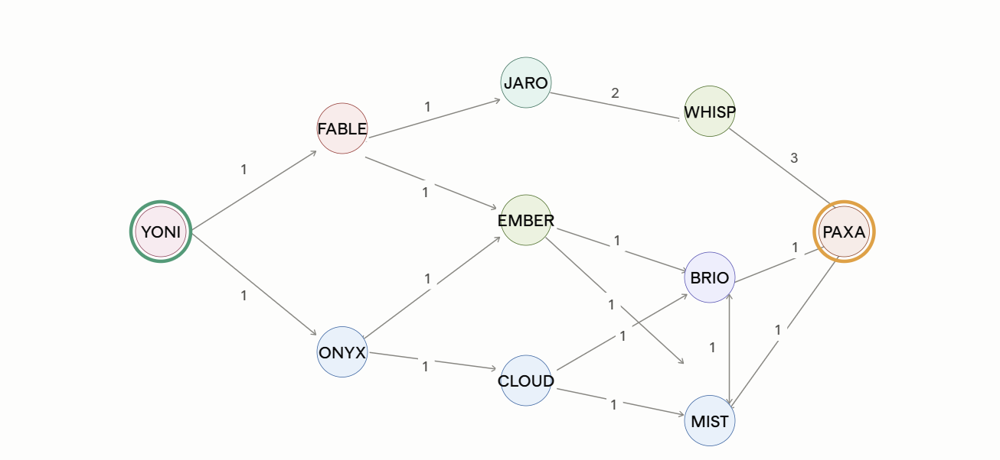
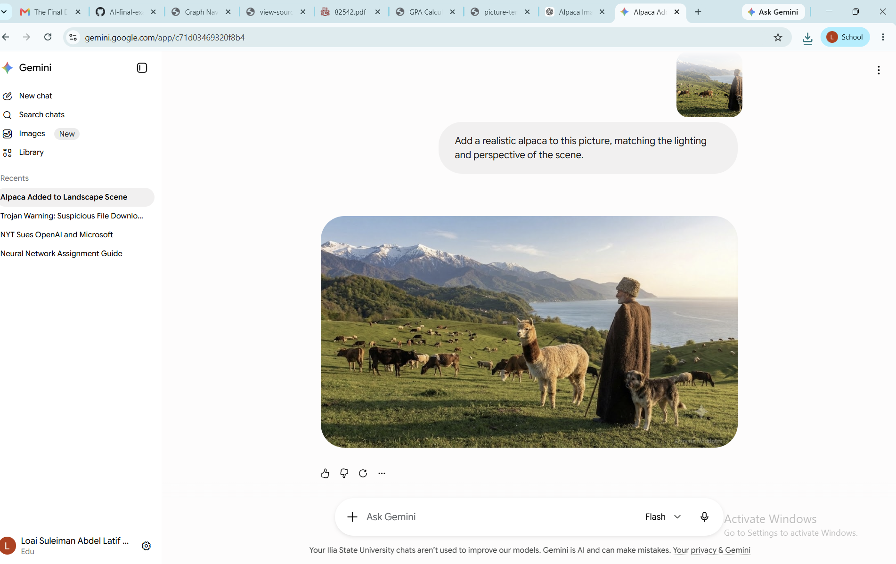

## Task 3 - Graph
   

# Introduction to AI — Final Exam

**Loai Kattmash**

---

## Task 1 — Adding an Alpaca with Generative AI

The original picture was edited using Google Gemini to add a realistic alpaca into the scene, matching the lighting and perspective of the landscape.

**Result:**

---

## Task 2 — User Manual: Adding an Alpaca to a Picture with Google Gemini

This manual explains, step by step, how to sign up for Google Gemini and use it to add an object (an alpaca) to an existing picture.

### Step 1 — Sign up / Sign in to Gemini

1. Open your web browser and go to **https://gemini.google.com**.
2. Click **Sign in** in the top-right corner.
3. Sign in with your Google account. If you do not have one, click **Create account** and follow the on-screen instructions (enter your name, choose an email address, set a password, and verify).
4. Once signed in, you will land on the main Gemini chat screen. Your account name appears at the bottom-left, confirming you are logged in.

### Step 2 — Prepare the original picture

1. Download the picture you want to edit and save it to your computer.

**Original picture:**

### Step 3 — Upload the picture and write the prompt

1. At the bottom of the Gemini chat, click the **+ (plus / upload)** button.
2. Select **Upload files** and choose the original picture from your computer.
3. Once the picture is attached, type a clear instruction in the message box, for example:

   > *Add a realistic alpaca to this picture, matching the lighting and perspective of the scene.*

4. Press **Enter** or click the send button.

### Step 4 — Get the result

1. Gemini processes the request and generates a new version of the picture with the alpaca added.
2. Review the result. If it is not satisfactory, you can refine the prompt and try again.
3. To save the image, hover over it and click the **download** icon, then choose where to save it on your computer.

**Final result with the alpaca added:**

The manual is complete: the user signs in, uploads the original picture, writes a prompt describing the object to add, and downloads the generated result.

---

## Task 3 — Finding the Graph

The chat bot was explored and its full graph was reconstructed. Every reachable node and every transition (including edge directions and weights) is shown below.

- **Start node:** YONI
- **Goal node:** PAXA

**One-way edges (single arrow):** YONI→FABLE (1), YONI→ONYX (1), FABLE→EMBER (1), ONYX→CLOUD (1), JARO→WHISP (2), EMBER→BRIO (1), EMBER→CLOUD (1), CLOUD→MIST (1), WHISP→PAXA (3), BRIO→PAXA (1)

**Two-way edges (double arrow):** FABLE↔JARO (1), ONYX↔EMBER (1), CLOUD↔BRIO (1), BRIO↔MIST (1), MIST↔PAXA (1)

---

## Task 4 — GPA Calculator Web Application

The web application is located in the `gpa` directory of this repository: [`gpa/index.html`](gpa/index.html).

It consists of a single HTML file with embedded CSS and JavaScript (no external libraries, frameworks, or CDNs). It implements all required subtasks:

- **Course list** — a table loads automatically with the columns *course*, *credit*, *grade*, and *passed*, containing the courses from the transcript plus 5 additional courses from the Computer Science program.
- **Program name** — the academic program (Computer Science) is displayed on screen.
- **GPA information** — an information icon reveals a tooltip containing the official Ilia State University GPA rules, translated into English.
- **Calculate** — computes the GPA from the courses using the official Ilia State University formula.
- **Calculate with Introduction to AI** — recalculates the GPA assuming the final score for Introduction to AI equals the current accumulated points plus the 30 final-exam points.
